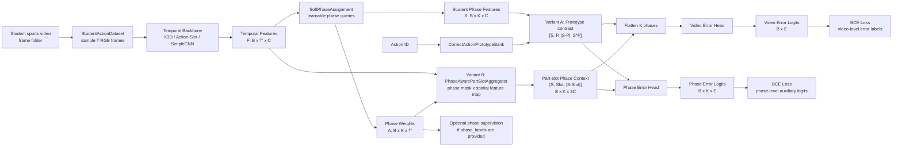
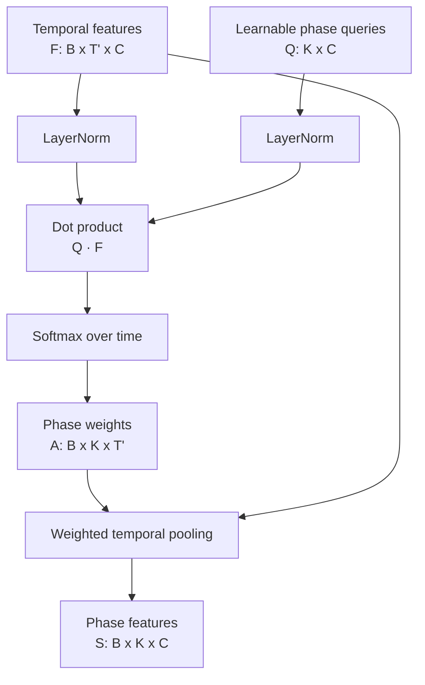
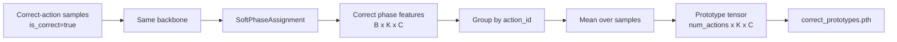

# Student Action Error Model

## Overall Architecture



## Soft Phase Assignment



Formula:

```text
A_phase = softmax((Q_phase * F_t) / sqrt(C), dim=time)
S_k = sum_t A_phase[k, t] * F_t
```

## Prototype Variant



## Runtime Tensor Shapes

| Symbol | Meaning | Shape |
| --- | --- | --- |
| `videos` | sampled RGB clip as list of tensors | `T x [B, 3, H, W]` |
| `F` | temporal features | `B x T' x C` |
| `A_phase` | soft phase assignment weights | `B x K x T'` |
| `S` | student phase features | `B x K x C` |
| `P` | correct phase prototypes selected by `action_id` | `B x K x C` |
| `X_spatial` | spatiotemporal feature map | `B x T' x H' x W' x C` |
| `Z_part` | phase-aware part-slot tokens | `B x K x P x C` |
| `D` | prototype contrast tensor `[S, P, abs(S-P), S*P]` | `B x K x 4C` |
| `D_part` | part-slot context tensor `[S, Slot, abs(S-Slot)]` | `B x K x 3C` |
| `phase_logits` | phase-wise error logits | `B x K x E` |
| `logits` | video-level error logits | `B x E` |

Where:

- `B`: batch size
- `T`: input frame count
- `T'`: backbone temporal output length
- `C`: feature dimension
- `K`: number of soft action phases
- `E`: number of error classes
- `P`: number of body-part slots

## Patent-Oriented Module Naming

```text
Student video acquisition module
  -> Action-slot temporal feature extraction module
  -> Soft action phase assignment module
  -> Optional correct action prototype knowledge base
  -> Optional phase-aware human-part slot aggregation module
  -> Student action error recognition module
```
